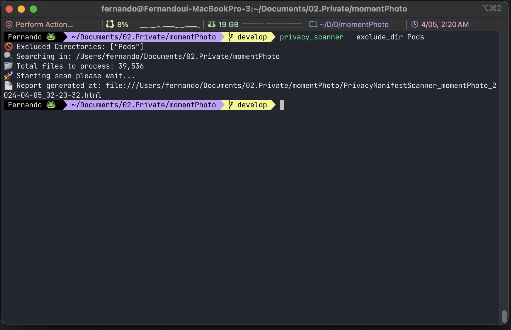

# 🕵️‍♂️ Privacy Manifest Scanner 
The Privacy Manifest Scanner is a command-line tool designed for iOS developers to scan their projects for privacy-sensitive APIs and operations. 
This tool helps in identifying potential areas within an iOS project that handle user data, thereby aiding in the audit and compliance with privacy standards.
Inspired by https://github.com/Wooder/ios_17_required_reason_api_scanner

## ✨ Features 
- Scans iOS project files (.swift, .m, .h) for specified privacy-sensitive APIs and operations.
- Allows exclusion of specific directories from the scan to focus on relevant areas. 
- Generates a detailed HTML report highlighting the found instances with file paths, line numbers, and content snippets. 
- Supports custom configurations for targeted scanning. 
 
 ## Installation 
 
 Clone this repository to your local machine using: 
 ```bash 
 git clone https://github.com/techinpark/ios_privacy_manifest_scanner.git
 ``` 

## 📖 Usage

### Install 

- Using [Mint](https://github.com/yonaskolb/Mint)
```sh 
$ brew install mint 
```

```sh
$ mint install techinpark/ios_privacy_manifest_scanner
```

```bash
$ privacy_scanner [flags]
```

### Flags:

- `--path <path>` : Specifies the root directory where the privacy scan should begin. This allows you to target a specific iOS project or directory for scanning. By setting this flag, you direct the scanner to recursively analyze all eligible files starting from the provided path. This is crucial for narrowing down the scan to relevant areas of your project and ensuring that the analysis is as efficient and relevant as possible.

- `--exclude_dir <directory>` : Excludes a specific directory (and its subdirectories) from the scan. This flag is particularly useful for omitting directories that contain third-party libraries, build artifacts, or any other files that are not relevant to the privacy audit. You can specify this flag multiple times to exclude multiple directories. This helps in reducing noise in the scan results by focusing only on the parts of the project that you manage directly or that are most likely to contain privacy-sensitive code.

Example:




To perform a privacy scan on a project located in ~/Documents/projectFolder while excluding the Pods directory (commonly used for CocoaPods dependencies in iOS projects), you can use the following command:

```bash 
$ privacy_scanner --path ~/Documents/projectFolder --exclude_dir Pods
```

## 🤝 Contributing

We welcome contributions! Please raise an issue or submit a pull request if you would like to contribute.

## 📜 License

Privacy Manifest Scanner is available under the MIT license. See the LICENSE file for more info.


